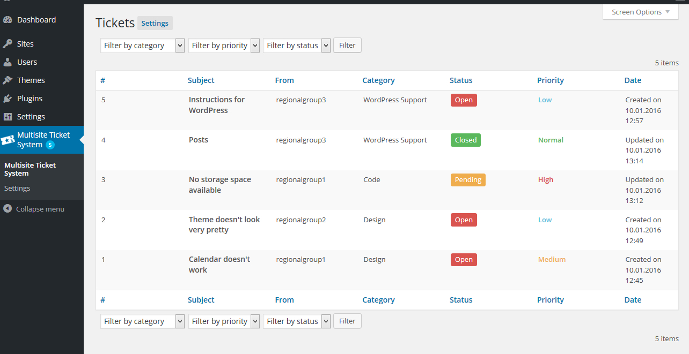
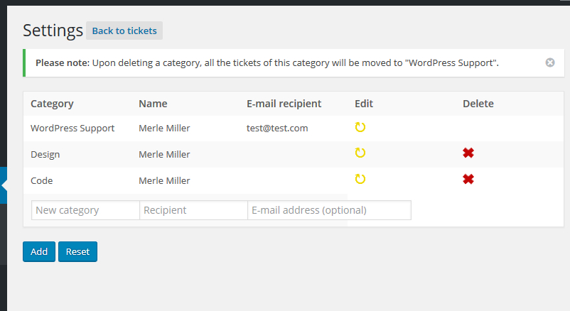
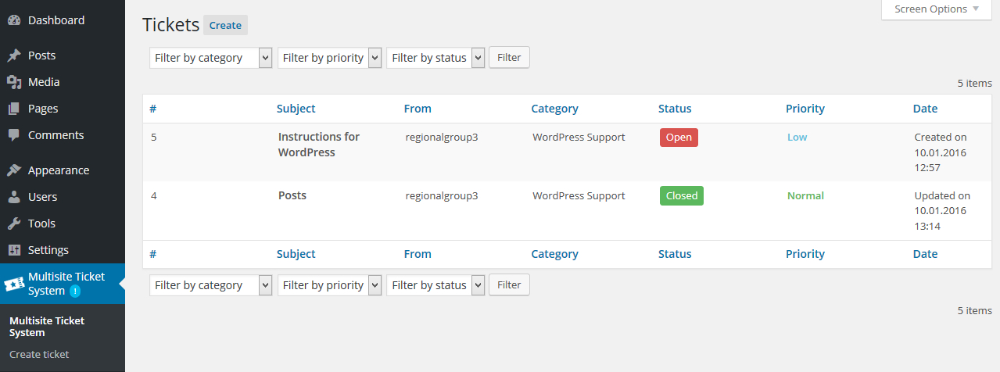
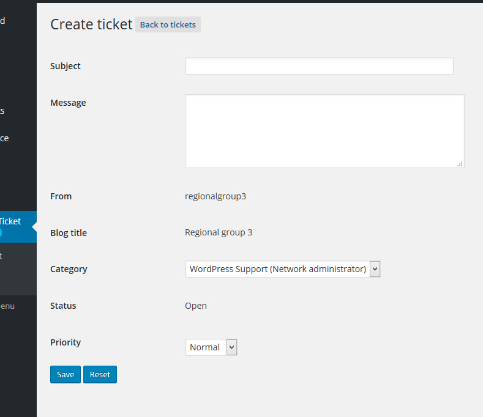

# Multisite Ticket System

Multisite Ticket System is a plugin for WordPress Multisite Network.

There are a lot of WordPress ticket system plugins out there, but rarely ones (or none) that are intended for improved communication between Super Admin and site Administrators in a Multisite Network.
This is all the more convenient if your organization manages many regional groups throughout the country or in general manages many sites that are administered by different people with diverse kinds of WordPress knowledge, especially by people with zero knowledge of WordPress. In these cases, the Super Admin is able to help more efficiently through this ticket system, e.g. instead of managing requests via e-mail.

To use the plugin, you have two choices:

1. Copy the downloaded and unzipped folder to your 'wordpress/wp-content/plugins' folder. 

2. Install the plugin through the WordPress plugins screen, it is also featured in the official WP Plugin Directory.

Since the plugin has been developed for a German organization, German texts are used in the plugin.
There are English translations available in the 'languages/' folder for US and GB (.mo files as well as .po files). If you wish to use the English translations for different countries as provided, either change the country code in the file name or message me and I will take care of it.
If you wish to test the plugin on a local server, you can use XAMPP or any other web server solution.
You will need the modules Apache and MySQL.

## Info
Plugin Name:  Multisite Ticket System

Description: Ticket support system for multisite network. Super Admin receives tickets and manages settings. Administrators of the sites (only) can submit tickets. Allows the installation of categories and e-mail addresses.

Version: 1.0

Author: Merle Miller

Text Domain: multisite-ticket-system

License: GPLv2+

License URI: https://www.gnu.org/licenses/gpl-2.0.html

Multisite Ticket System is free software: you can redistribute it and/or modify
it under the terms of the GNU General Public License as published by
the Free Software Foundation, either version 2 of the license, or
any later version.

Multisite Ticket System is distributed in the hope that it will be useful,
but WITHOUT ANY WARRANTY; without even the implied warranty of
MERCHANTABILITY or FITNESS FOR A PARTICULAR PURPOSE. See the
GNU General Public License for more details.

You should have received a copy of the GNU General Public License
along with Multisite Ticket System. If not, see License URI.

## Screenshots

You can find some screenshots of the plugin features in the "screenshots/" folder.

Tickets overview in Network Admin:

Settings overview in Network Admin:

Tickets overview in Site Admin:

Create a ticket in Site Admin:

